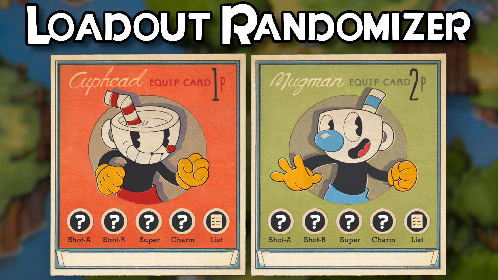

# CupheadLoadoutRandomizer
This mod adds a new button to the Equip Menu that randomizes your weapons, charm, and super based on what you currently have unlocked.

The mod also supports any additional custom weapons, charms, and supers you may have installed through the Blender API.

### How to Install
Extract the zip in C:\Program Files (x86)\Steam\steamapps\common\Cuphead (or wherever you have Cuphead installed)

### How to Use in Game
Open the Equip Menu and there should be a Randomize button at the bottom of the screen bound to your shoot button. Pressing it will randomize your current weapons, charm, and super.

